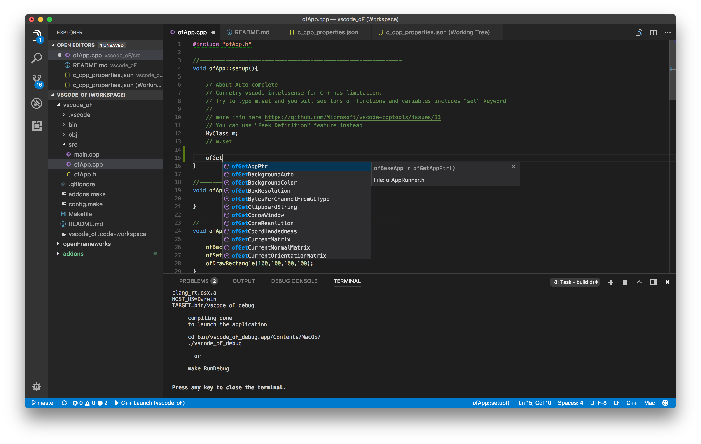

# NOTICE
Hello, thanks for visiting this repo.
Few yeaers ago, I sent a PR which generates vscode project from oF's Project Generator.
It was quickly merged and you can use vscode with oF without this repo.
So I no longer update this repo.

Please check oF main repo and also this thread in the forum.
https://forum.openframeworks.cc/t/vscode-visual-studio-code-of/28504

I will soon archive this repo to avoid confusion.
But let me know if it is still useful for some reason.



[](https://travis-ci.org/hiroMTB/vscode_oF)
[](https://ci.appveyor.com/project/hiroMTB/vscode-of/branch/master)

# vscode_oF
openFrameworks empty example for Microsoft Visual Studio Code IDE(vscode).
This is not addon. (folder structure is same with addoon)

# How to compile example project
1. download and install vscode.
2. download or clone this repositry to your /oF/apps folder
2. open project file with vscode(vscode_oF.code-workspace).
3. Command Palette (View->Command Palette) and select "Run Build Task".
4. Select "Build Debug", "Clean ALL", "Build Release", "Clean Debug", "Clean All"
5. Hit F5 key to start debugging. (Release app will start automaticaly after build)

# How to start your own project
1. Copy and paste /exampleEmpty folder and start your own project.
2. Edit addons.make file if you want to add addons
3. You might need to edit setting files inside of ./vscode

It provides quick auto complete feature.
Since vscode does not provide built-in debugger, debugging feature is depends on platform.

Curretly tested on OSX, Ubuntu(by @anselanza) and Windows 10.


## 
## Folder Structure
```
/of
  /apps
    /vscode_oF
      /exampleEmpty
```

## oF version
0.10.0, latest master

## Known issue
+ "make clean" does not work (bug of openFrameworks Make system)
+ MacOSX.sdk path is hard coded
+ "#include error detected" for header files which is not actualy included
    for example GL/gl.h is for Linux wihch is not included on osx. This shold be fixed with limitSymbolsToIncludedHeaders property in c_cpp_properties.json
    But still vs code claims it is missing.

## Linux user
+ Depends on your Linux distro, you might need additinal edit on config files. Please see dev branch which include commits from another oF+Linux developper. I don't test dev branch but it might help. 
